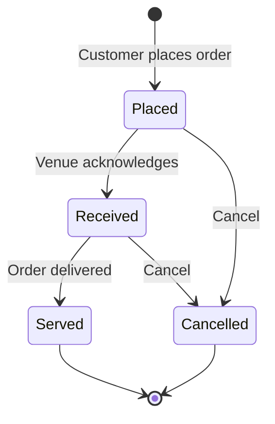

# DineIn

> **Dine-in ordering for Rwanda and Malta** — 3 mobile-first PWAs for customers, venue owners, and admins.

---

## What DineIn IS

- 📱 **Dine-in only** ordering system
- 🔗 **QR-first** — scan to open menu, no app install required
- 🌍 **Two countries** — Rwanda (RWF/MoMo) and Malta (EUR/Revolut)
- 🏪 **Three apps** — Customer, Venue Portal, Admin Portal
- ⚡ **Real-time** — order status updates via Supabase Realtime

## What DineIn is NOT

> [!IMPORTANT]
> These features are **explicitly out of scope**:

- ❌ **No delivery** — dine-in only, no couriers or drivers
- ❌ **No maps/location** — no geolocation or "near me"
- ❌ **No payment APIs** — payments are external handoffs only
- ❌ **No in-app QR scanner** — scanning happens via phone camera
- ❌ **No payment verification** — no webhooks or confirmations

---

## Quick Start

### Prerequisites

- Node.js 20+
- pnpm 8+

### 1. Install Dependencies

```bash
git clone <repo-url>
cd dinein
pnpm install
```

### 2. Configure Environment

```bash
# Copy env templates
cp apps/customer/.env.example apps/customer/.env
cp apps/venue/.env.example apps/venue/.env
cp apps/admin/.env.example apps/admin/.env
```

Add your Supabase credentials:
```
VITE_SUPABASE_URL=https://your-project.supabase.co
VITE_SUPABASE_ANON_KEY=your-anon-key
```

See [docs/env-matrix.md](docs/env-matrix.md) for full variable list.

### 3. Run Development Server

```bash
# Customer app (http://localhost:5173)
cd apps/customer && pnpm dev

# Venue portal (http://localhost:5174)
cd apps/venue && pnpm dev

# Admin portal (http://localhost:5175)
cd apps/admin && pnpm dev
```

### 4. Build for Production

```bash
pnpm build  # Builds all apps
```

---

## Monorepo Structure

```
dinein/
├── apps/
│   ├── customer/          # Guest-facing PWA
│   ├── venue/             # Venue owner portal
│   └── admin/             # Admin dashboard
├── packages/
│   ├── core/              # Types, constants, utils
│   ├── db/                # Supabase query helpers
│   ├── ui/                # Shared components
│   └── commons/           # Common utilities
├── supabase/
│   ├── migrations/        # SQL migrations
│   └── functions/         # Edge Functions
├── docs/                  # Documentation
└── scripts/               # CI/CD utilities
```

### Package Dependencies

```mermaid
graph LR
    Customer[apps/customer] --> Core[@dinein/core]
    Customer --> DB[@dinein/db]
    Customer --> UI[@dinein/ui]
    Venue[apps/venue] --> Core
    Venue --> DB
    Venue --> UI
    Admin[apps/admin] --> Core
    Admin --> DB
    Admin --> UI
    UI --> Core
    DB --> Core
```

---

## Tech Stack

| Layer | Technology |
|-------|------------|
| **Framework** | React 18, TypeScript, Vite |
| **Styling** | Tailwind CSS 4, Radix UI, Framer Motion |
| **State** | Zustand (cart), React Context (auth) |
| **Backend** | Supabase (Postgres, Auth, Edge Functions) |
| **Realtime** | Supabase Realtime |
| **Deployment** | Cloudflare Pages |
| **PWA** | vite-plugin-pwa, Workbox |
| **Testing** | Playwright (E2E), Vitest (unit) |

---

## Core Routes & Deep Links

### Customer App

| Route | Description |
|-------|-------------|
| `/` | Home — venue discovery |
| `/v/{slug}` | **Deep link** — opens venue menu directly |
| `/v/{slug}?t=12` | With table number |
| `/cart` | Shopping cart |
| `/checkout` | Order checkout |
| `/order/{id}` | Order status |
| `/settings` | User settings |

**Navigation:** 2 tabs only — Home + Settings

### Entry Behavior

1. Customer scans QR code → opens `/v/{venueSlug}`
2. App loads venue data
3. Sets `activeCountry` from `venue.country`
4. Menu displays with correct currency (RWF or EUR)

### Venue Portal

| Route | Auth Required |
|-------|---------------|
| `/login` | No |
| `/claim` | No |
| `/dashboard` | Yes (owner) |
| `/orders` | Yes (owner) |
| `/menu` | Yes (owner) |
| `/settings` | Yes (owner) |

### Admin Portal

| Route | Auth Required |
|-------|---------------|
| `/login` | No |
| `/dashboard` | Yes (admin) |
| `/claims` | Yes (admin) |
| `/venues` | Yes (admin) |
| `/users` | Yes (admin) |
| `/audit` | Yes (admin) |

---

## Country Mode

| Country | Currency | Payment | Handoff |
|---------|----------|---------|---------|
| **Rwanda (RW)** | RWF | MoMo | USSD code displayed (no API) |
| **Malta (MT)** | EUR | Revolut | External link opened (no API) |

> [!NOTE]
> Payments are **handoffs only**. DineIn does not integrate with payment APIs or verify transactions.

---

## Order Statuses



**Only these statuses exist:** `Placed` | `Received` | `Served` | `Cancelled`

---

## Database & Supabase

### Key Tables

| Table | Purpose |
|-------|---------|
| `vendors` | Venues (bars/restaurants) with `claimed` status |
| `menu_categories` | Category groupings |
| `menu_items` | Individual menu items |
| `orders` | Customer orders |
| `order_items` | Line items per order |
| `profiles` | User profiles with roles |
| `audit_logs` | System audit trail |

### Migrations

```bash
cd supabase

# Link to project
npx supabase link --project-ref <project-id>

# Push migrations
npx supabase db push

# Generate types
npx supabase gen types typescript --linked > ../packages/db/src/database.types.ts
```

### RLS Policies

| Access Level | Tables |
|--------------|--------|
| **Public read** | `vendors`, `menu_categories`, `menu_items` (active) |
| **Auth write** | `orders` (own), venue data (owner) |
| **Admin only** | All tables, `audit_logs` |

---

## RBAC: Roles & Permissions

| Role | Scope | UI Access | API Access | DB Access |
|------|-------|-----------|------------|-----------|
| **Customer** | Public | Browse, order | Read menus, write orders | RLS: own orders |
| **Owner** | Own venue | Venue portal | Own venue data | RLS: venue_id match |
| **Admin** | All | Admin portal | All endpoints | RLS: admin role |

### Enforcement Layers

1. **UI**: Route guards, conditional rendering
2. **Context**: `useOwner()`, `useAdmin()` hooks
3. **API**: Edge Function auth checks
4. **Database**: RLS policies on every table

---

## UI/UX Standards

### Design System: "Soft Liquid Glass"

- Translucent surfaces with `backdrop-blur`
- Subtle shadows for hierarchy
- Smooth `animate-in` / `animate-out` transitions
- Respects `prefers-reduced-motion`

### Mandatory States

Every async component must handle:
- ⏳ **Loading** — Skeleton or spinner
- 📭 **Empty** — Meaningful empty state
- ❌ **Error** — User-friendly message + retry

### Mobile-First

- Design for 360px width first
- Touch targets ≥ 44px
- Bottom navigation (customer app)
- Thumb-reachable actions

---

## PWA Notes

### Features

- **Standalone** display mode
- **Offline** support for cached pages
- **Background sync** for offline orders (customer)
- **Install prompt** after engagement

### Update Strategy

- `skipWaiting` enabled for immediate updates
- No stale bundles after deploy

See [docs/pwa.md](docs/pwa.md) for full configuration.

---

## Testing

### Commands

```bash
# Unit tests
pnpm --filter @dinein/core test

# E2E tests
cd apps/customer
pnpm exec playwright test

# With UI
pnpm exec playwright test --ui
```

### Critical Flows

| App | Flow |
|-----|------|
| Customer | Home → Venue → Add to Cart → Checkout → Order (≤4 taps) |
| Venue | Login → Orders → Update Status |
| Admin | Login → Claims → Approve |

See [docs/testing.md](docs/testing.md) for full testing guide.

---

## Deployment (Cloudflare Pages)

### Per-App Settings

| App | Root Directory | Build Command | Output |
|-----|----------------|---------------|--------|
| Customer | `apps/customer` | `pnpm build` | `dist` |
| Venue | `apps/venue` | `pnpm build` | `dist` |
| Admin | `apps/admin` | `pnpm build` | `dist` |

### Environment Variables

Set in Cloudflare Pages dashboard:
- `VITE_SUPABASE_URL`
- `VITE_SUPABASE_ANON_KEY`
- `VITE_ENV=production`

### SPA Routing

Add `_redirects` to `public/`:
```
/*    /index.html   200
```

### Rollback

1. Cloudflare Dashboard → Pages → Deployments
2. Find previous working deployment
3. Click "Rollback to this deployment"

---

## Development Workflows

### Agent Workflows (Antigravity)

| Workflow | Purpose |
|----------|---------|
| `/kickoff` | Start any task with scope lock |
| `/scope-guard` | Verify no banned features added |
| `/pwa-quality-slice` | PWA installability and performance |
| `/fullstack-audit` | Comprehensive repo audit |
| `/readme-for-real` | This README workflow |

### Scope Guard

Before merging, run `/scope-guard` to verify:
- No delivery features
- No maps/location
- No payment APIs
- No in-app scanner
- Order statuses correct
- Entry behavior correct

---

## Troubleshooting

| Symptom | Cause | Fix |
|---------|-------|-----|
| Endless loading | Missing env vars | Check `.env` files |
| 403 on data fetch | RLS policy denial | Check user role |
| Stale UI after deploy | Cached SW | Hard refresh or clear SW |
| Auth redirect loop | Invalid session | Clear localStorage |
| Build fails | Type errors | Run `pnpm exec tsc` |

### Logs

- **Frontend**: Browser DevTools Console
- **Supabase**: Dashboard → Logs
- **Cloudflare**: Pages → Deployments → Functions

---

## Contributing

### Branch Strategy

```
main (production)
└── feature/your-feature
└── fix/your-fix
```

### Commit Format

```
feat(customer): add cart animations
fix(venue): order status update
chore(db): add migration for claimed column
```

### PR Checklist

- [ ] `pnpm lint` passes
- [ ] `pnpm build` passes
- [ ] No drive-by refactors
- [ ] Loading/empty/error states exist
- [ ] RBAC enforced at all layers
- [ ] `/scope-guard` passes

### Code Style

- TypeScript strict mode
- No `any` without justification
- Shared code in `packages/`, not duplicated

---

## Documentation

| Doc | Contents |
|-----|----------|
| [docs/env-matrix.md](docs/env-matrix.md) | Environment variables |
| [docs/architecture.md](docs/architecture.md) | System architecture |
| [docs/pwa.md](docs/pwa.md) | PWA configuration |
| [docs/testing.md](docs/testing.md) | Testing guide |

---

## License

Proprietary — DineIn Malta / Rwanda.

---

## Verification Checklist

- [x] Commands match `package.json` scripts
- [x] Repo structure matches actual files
- [x] Env vars documented correctly
- [x] No banned features mentioned
- [x] Links to `/docs` files are valid
- [x] Scope lock section is explicit
