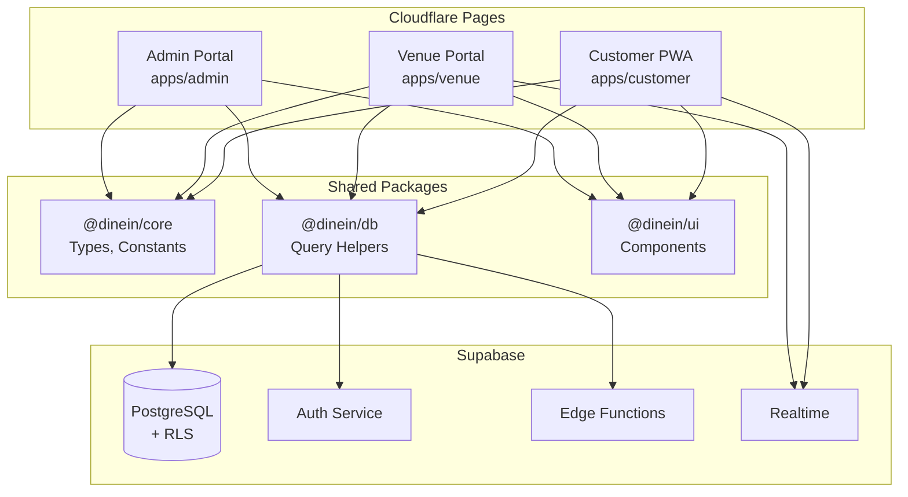
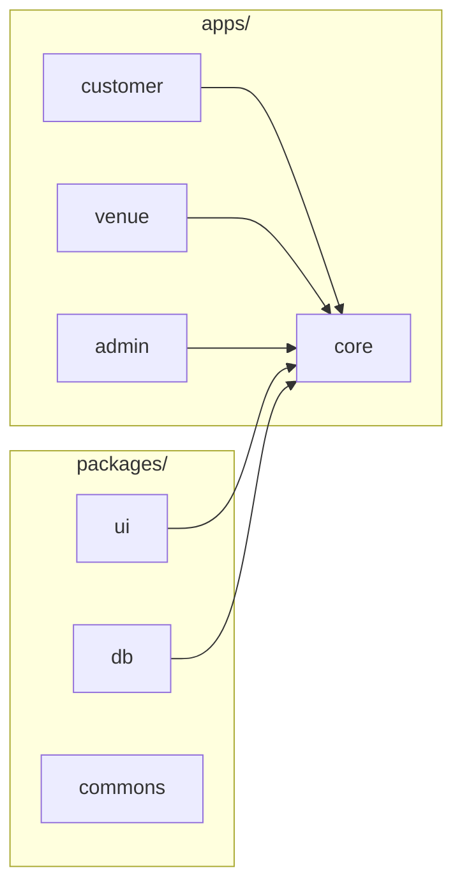
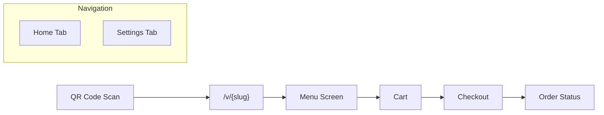
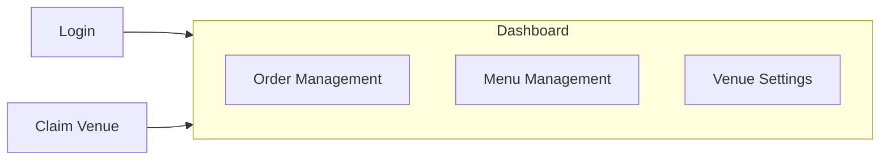
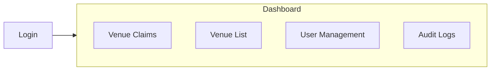
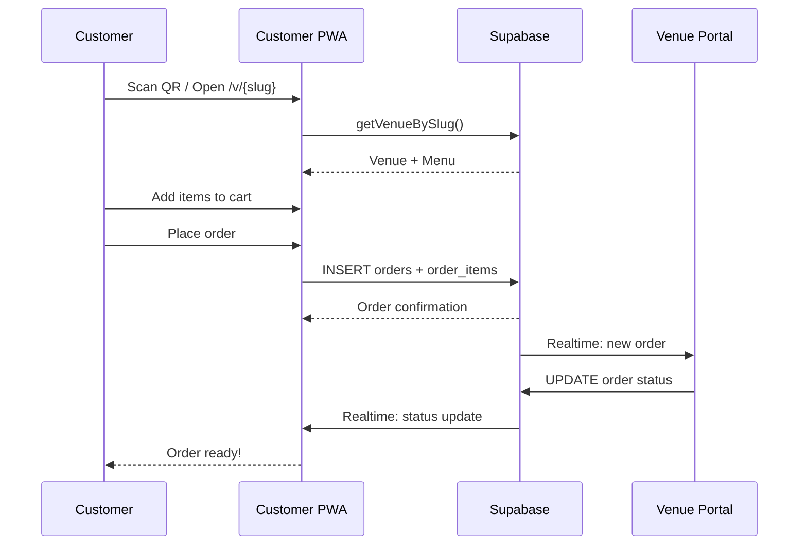
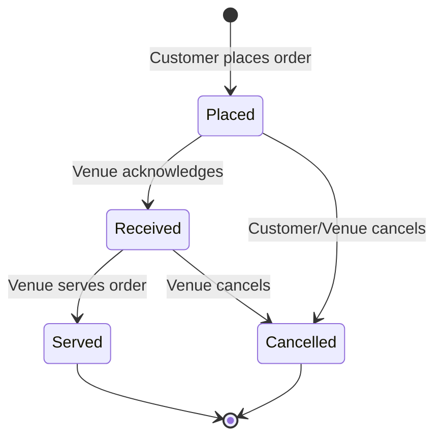
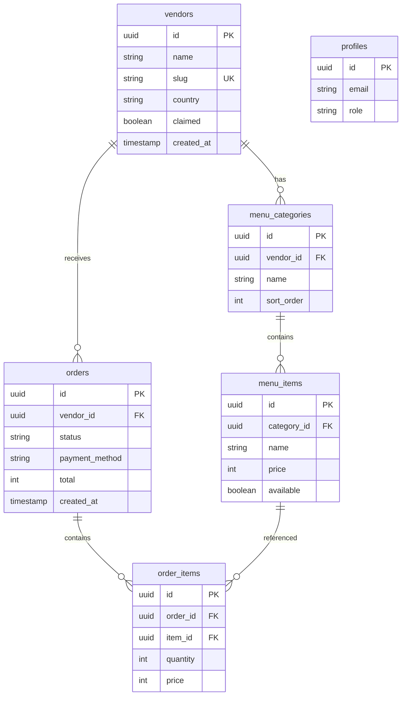

# DineIn Architecture

This document describes the system architecture of the DineIn monorepo.

---

## System Overview



---

## Monorepo Structure



### Package Responsibilities

| Package | Purpose | Exports |
|---------|---------|---------|
| `@dinein/core` | Domain types, constants, utils | `OrderStatus`, `PaymentMethod`, `Country`, formatters |
| `@dinein/db` | Supabase query helpers | `getVenueBySlug`, `getMenuItems`, `placeOrder` |
| `@dinein/ui` | React component library | `Button`, `Card`, `Badge`, `BottomSheet` |
| `@dinein/commons` | Shared utilities | Common helpers |

---

## Application Architecture

### Customer App (apps/customer)



**Key Features:**
- QR deep link entry (`/v/{venueSlug}`)
- Menu browsing with categories
- Cart management (Zustand)
- Order placement
- Order status tracking (Realtime)

### Venue Portal (apps/venue)



**Key Features:**
- Venue owner authentication
- Venue claim flow
- Order status updates (Placed → Received → Served)
- Menu CRUD operations
- Real-time order notifications

### Admin Portal (apps/admin)



**Key Features:**
- Admin-only authentication
- Approve/reject venue claims
- View all venues
- User management
- System audit logs

---

## Data Flow

### Customer Order Flow



### Order Status Flow



**Allowed Statuses:** `Placed` | `Received` | `Served` | `Cancelled`

---

## Tech Stack

| Layer | Technology |
|-------|------------|
| **Frontend** | React 18, TypeScript, Vite |
| **Styling** | Tailwind CSS 4, Radix UI, Framer Motion |
| **State** | Zustand (cart), React Context (auth) |
| **Backend** | Supabase (Postgres, Auth, Edge Functions) |
| **Realtime** | Supabase Realtime |
| **Deployment** | Cloudflare Pages |
| **PWA** | vite-plugin-pwa, Workbox |
| **Testing** | Playwright (E2E), Vitest (unit) |

---

## Database Schema



---

## Security Model

### Row Level Security (RLS)

| Table | Public Read | Auth Write | Admin Only |
|-------|-------------|------------|------------|
| `vendors` | ✅ (active) | Owner only | ✅ |
| `menu_categories` | ✅ | Owner only | ✅ |
| `menu_items` | ✅ (available) | Owner only | ✅ |
| `orders` | Own only | Own only | ✅ |
| `profiles` | ❌ | Own only | ✅ |
| `audit_logs` | ❌ | ❌ | ✅ |

### RBAC Enforcement

```
┌─────────────────────────────────────────────────┐
│                    UI Layer                     │
│  Route guards, conditional rendering            │
├─────────────────────────────────────────────────┤
│                 Context Layer                   │
│  useOwner, useAdmin hooks                       │
├─────────────────────────────────────────────────┤
│                   API Layer                     │
│  Edge Functions with auth checks                │
├─────────────────────────────────────────────────┤
│                  Database Layer                 │
│  RLS policies on every table                    │
└─────────────────────────────────────────────────┘
```

---

## Country Mode

| Country | Currency | Payment Method | Handoff Type |
|---------|----------|----------------|--------------|
| **Rwanda (RW)** | RWF | MoMo | USSD code (no API) |
| **Malta (MT)** | EUR | Revolut | External link (no API) |

**How it works:**
1. Customer scans QR → opens `/v/{venueSlug}`
2. App loads venue → reads `venue.country`
3. Sets `activeCountry` in app state
4. Checkout shows appropriate payment option
5. Payment is a handoff (opens external app/link)

> [!IMPORTANT]
> DineIn does NOT integrate with payment APIs. Payments are handled externally.
