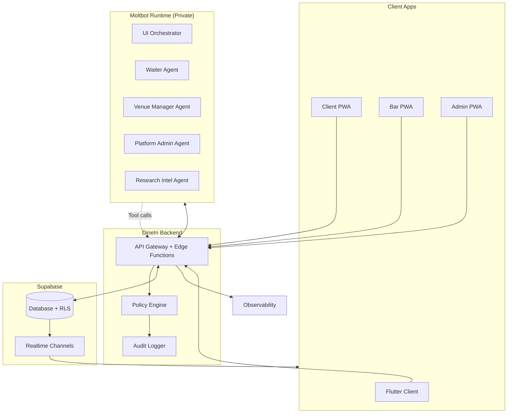
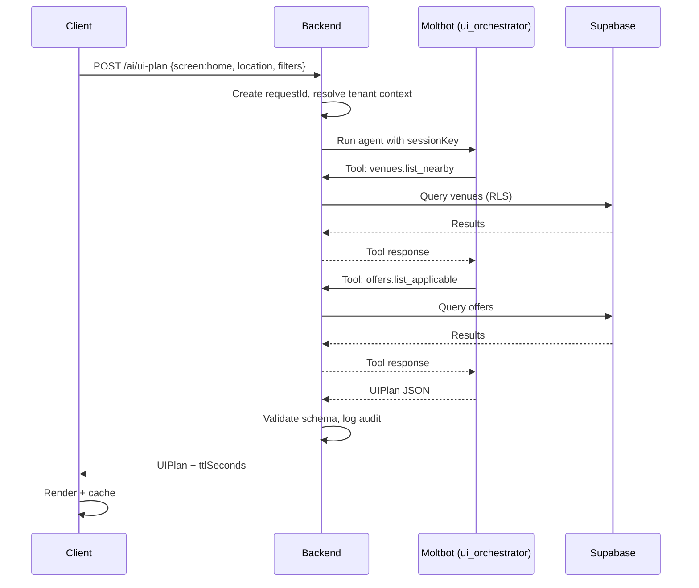
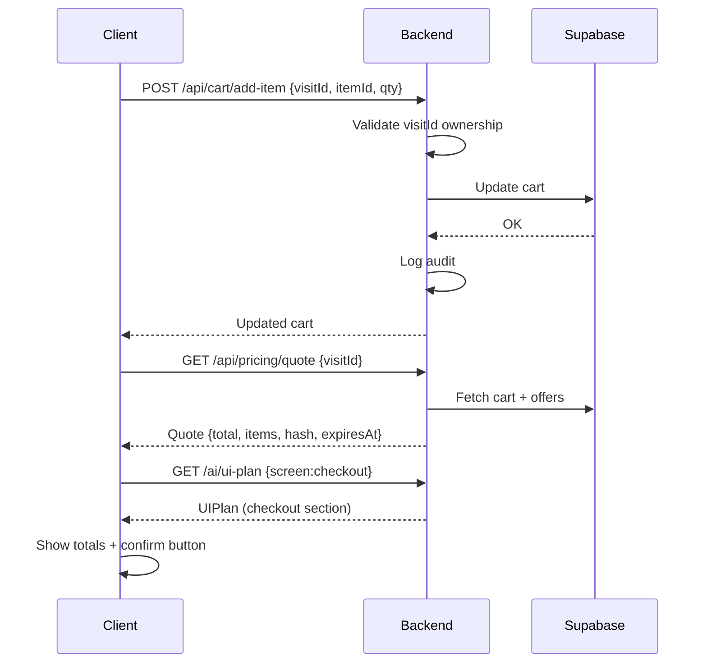
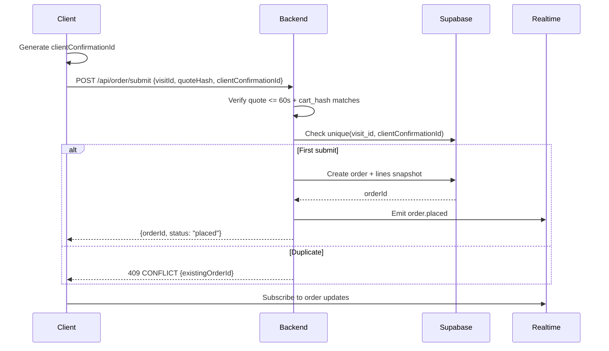
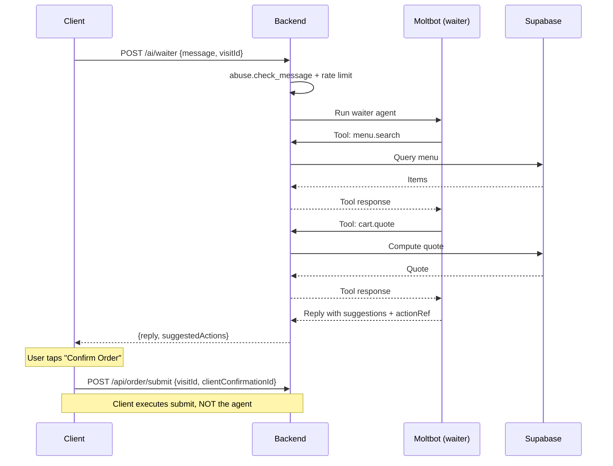
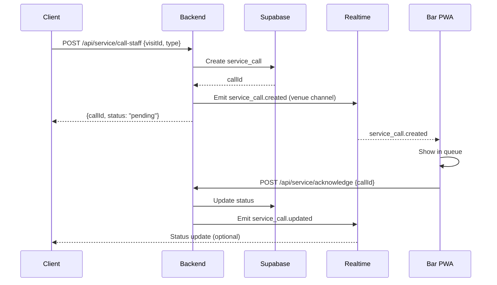
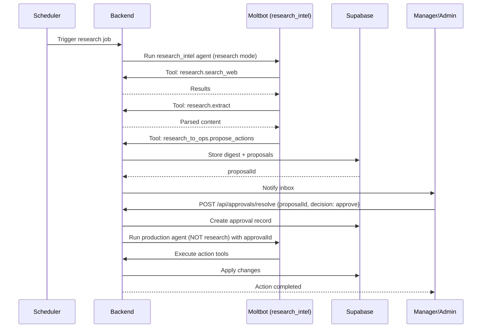

# Moltbot ↔ DineIn Integration Summary

> **WF-NEXT-15** — Single authoritative blueprint: architecture, sequences, and final checklist.

---

## Architecture Overview



---

## Component Responsibilities

| Component | Responsibilities | Never Does |
|-----------|------------------|------------|
| **Flutter Client** | Render UIPlan, dispatch safe intents, waiter chat UI | Never calls Moltbot, never executes unknown intents |
| **Client PWA** | Same as Flutter: UIPlan rendering + intent dispatch | Never calls Moltbot directly |
| **Bar PWA** | Orders + service calls queue, manager console (drafts, approvals), venue audit | No direct AI calls |
| **Admin PWA** | Platform approvals, support tickets, audit search/export, risk controls | No direct AI calls |
| **Backend Gateway** | Auth, tenant/venue context, policy enforcement, data access via RLS, calls Moltbot, validates outputs, telemetry + audit | No business logic leakage |
| **Supabase** | Multi-tenant data store, RLS isolation, realtime channels | No agent logic |
| **Moltbot Runtime** | Agents (UI Orchestrator, Waiter, Manager, Admin, Research), tool routing, allowlist enforcement | No direct DB access |
| **Observability** | Dashboards (latency, errors, denials), alerts (probing, bypass, anomalies) | — |

---

## Data Flow Principle

> **All trust boundaries terminate in the backend.**

```
Client → Backend: UIPlan request, intent execution, waiter messages
Backend → Moltbot: agent run with sessionKey + requestId
Moltbot → Backend: tool calls (via tool wrappers) with policy checks
Backend → Supabase: queries/mutations subject to RLS + server checks
Supabase → Clients: realtime events (scoped)
```

---

## Sequence Diagrams

### SEQ-01: Home Screen UIPlan



---

### SEQ-02: Add to Cart and Checkout



---

### SEQ-03: Order Submit (Idempotent)



---

### SEQ-04: Waiter Chat (Guided Ordering)



> **Safety**: Agent recommends; client executes submit after explicit user confirmation.

---

### SEQ-05: Call Staff / Request Bill



---

### SEQ-06: Research Intel → Proposal → Approval



---

## Final Implementation Checklist

### Security & Policy

- [ ] Deny-by-default tool allowlists per agent enforced
- [ ] Production mode blocks research tools; research mode blocks mutations
- [ ] Tenant/venue context enforced end-to-end (no cross-tenant reads)
- [ ] `order.submit` requires fresh quote + cart_hash match + clientConfirmationId
- [ ] Approvals required for publish/refunds/access changes; backend rejects bypass
- [ ] `abuse.check_message` before waiter processing; rate limits active

### Backend

- [ ] DB schema created with indexes
- [ ] RLS policies verified (guest/staff/admin)
- [ ] Edge endpoints implemented for all MVP tools
- [ ] Realtime channels configured and scoped
- [ ] Telemetry and audit logs wired with requestId/sessionKey

### Moltbot Plugin

- [ ] DineIn plugin created with tool wrappers and schema validators
- [ ] Agents installed: ui_orchestrator + waiter (MVP), manager/admin (next), research (optional)
- [ ] UIPlan schema validation enforced before return

### Frontend (Flutter + PWA)

- [ ] UIPlan renderer implemented with section registry
- [ ] Intent dispatcher allowlisted; unknown intents ignored and logged
- [ ] Confirm dialogs enforced for `requiresConfirmation`
- [ ] Offline mode shows cached UI and disables mutations
- [ ] Waiter chat UI implemented with no auto-execution of actionRefs

### Bar + Admin PWA

- [ ] Bar queue for orders and service calls working
- [ ] Approvals inbox + draft editors + simulations (venue scope)
- [ ] Admin audit search/export + incident queue

### Testing

- [ ] Seed fixtures load reliably
- [ ] E2E tests T1–T7 pass
- [ ] Redteam suite passes (no tool bypass, no leakage)

### Rollout

- [ ] Feature flags + kill switches operational
- [ ] Shadow mode metrics stable
- [ ] Gates to Assisted and Full mode defined and monitored

---

## Acceptance Criteria

1. This checklist can be executed to reach a safe MVP launch
2. Sequence diagrams map exactly to implemented endpoints and agents
3. No direct Moltbot exposure; backend remains control plane
4. All trust boundaries terminate in the backend
5. Research mode is fully sandboxed from production mutations
